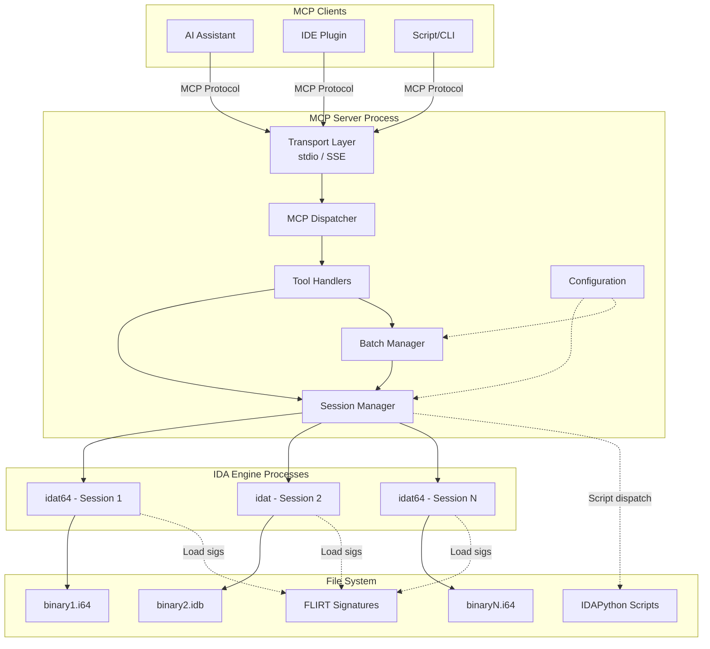
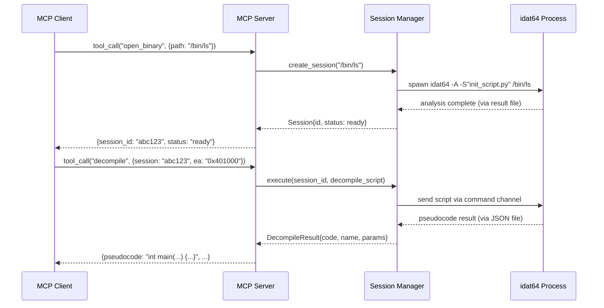
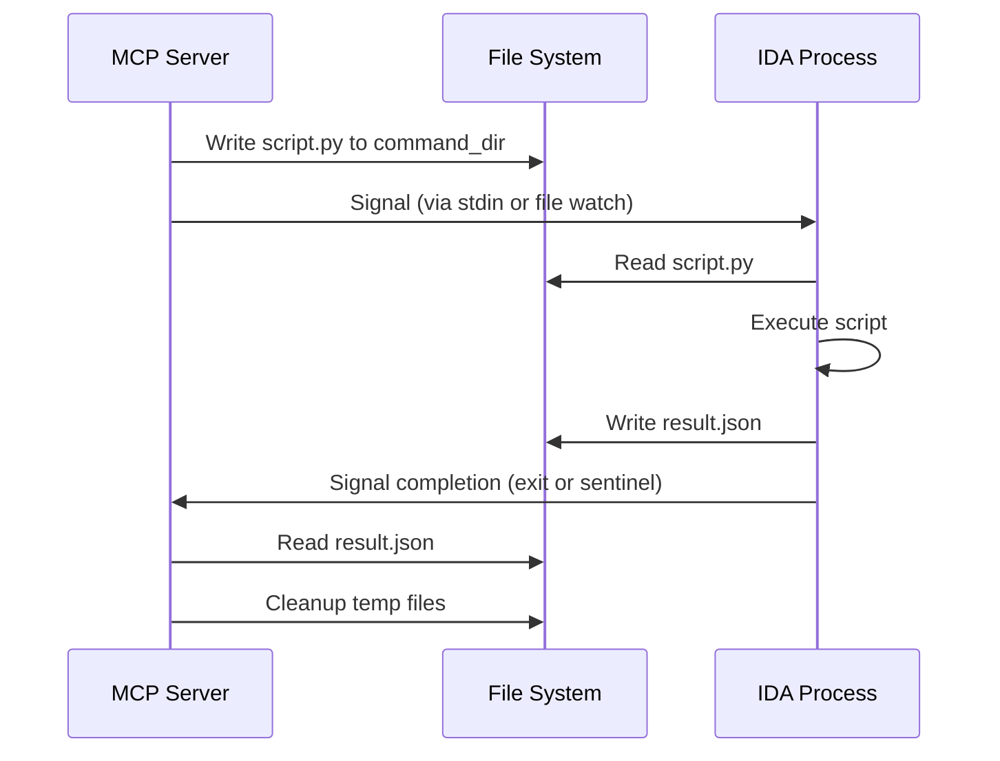
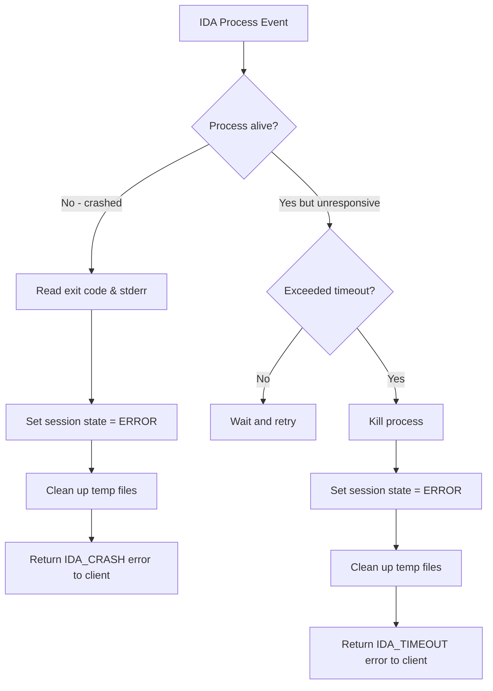

# Design Document: IDA Headless MCP Server

## Overview

The IDA Headless MCP Server is a Python-based service that wraps IDA Pro's headless analysis engine (`idat`/`idat64`) and exposes reverse engineering capabilities as MCP (Model Context Protocol) tools. The server manages IDA Pro processes, communicates with them via IDAPython scripts, and presents a structured tool interface to MCP clients over stdio or SSE transports.

The core design challenge is bridging the MCP protocol (request/response over JSON) with IDA Pro's headless mode, which runs as a separate OS process. The server must manage process lifecycles, serialize commands into IDAPython scripts, capture results, and handle failures — all while supporting multiple concurrent analysis sessions.

### Key Design Decisions

1. **Process-per-session model**: Each IDB analysis session runs in its own `idat`/`idat64` process. This provides isolation (a crash in one session doesn't affect others) and matches IDA's single-database-per-process constraint.

2. **Script-based IPC**: Communication with IDA processes uses IDAPython scripts passed via stdin/temp files and results returned via stdout/JSON files. This avoids needing custom IDA plugins or shared memory.

3. **Async session management**: The server uses Python's `asyncio` to manage multiple sessions concurrently, with a configurable limit on concurrent IDA processes.

4. **MCP SDK integration**: Built on the official `mcp` Python SDK, which handles protocol framing, tool registration, and transport negotiation.

## Architecture



### Component Interaction Flow



### Layered Architecture

The system follows a layered architecture:

| Layer | Responsibility | Key Classes |
|-------|---------------|-------------|
| **Transport** | MCP protocol framing, stdio/SSE | `StdioTransport`, `SSETransport` (from MCP SDK) |
| **Dispatcher** | Tool registration, request routing | `McpServer` (from MCP SDK) |
| **Tool Handlers** | Input validation, response formatting | `FunctionTools`, `DecompileTools`, `XrefTools`, etc. |
| **Session Manager** | Process lifecycle, session state | `SessionManager`, `Session` |
| **IDA Bridge** | Script generation, result parsing | `IdaBridge`, `ScriptBuilder` |
| **Batch Manager** | Multi-binary job orchestration | `BatchManager`, `BatchJob` |


## Components and Interfaces

### 1. MCP Server (`server.py`)

The entry point. Configures the MCP SDK server, registers all tools, and starts the transport.

```python
class IdaMcpServer:
    """Main server class that wires together all components."""

    def __init__(self, config: ServerConfig):
        self.config = config
        self.session_manager = SessionManager(config)
        self.batch_manager = BatchManager(self.session_manager, config)
        self.mcp = McpServer("ida-headless-mcp")
        self._register_tools()

    async def run(self, transport: str = "stdio") -> None:
        """Start the server on the specified transport."""
        ...

    def _register_tools(self) -> None:
        """Register all MCP tool handlers."""
        ...
```

### 2. Configuration (`config.py`)

```python
@dataclass
class ServerConfig:
    ida_path: str                    # Path to idat/idat64 directory
    ida_binary_32: str = "idat"      # 32-bit executable name
    ida_binary_64: str = "idat64"    # 64-bit executable name
    max_concurrent_sessions: int = 5
    session_timeout: int = 3600      # seconds
    script_timeout: int = 300        # seconds per script execution
    batch_max_concurrent: int = 3
    signatures_dir: str | None = None
    transport: str = "stdio"         # "stdio" or "sse"
    sse_host: str = "127.0.0.1"
    sse_port: int = 8080
```

### 3. Session Manager (`session_manager.py`)

Manages the lifecycle of IDA process sessions.

```python
class SessionState(Enum):
    STARTING = "starting"
    ANALYZING = "analyzing"
    READY = "ready"
    BUSY = "busy"
    ERROR = "error"
    CLOSED = "closed"

class Session:
    session_id: str
    binary_path: str
    idb_path: str
    architecture: Literal["32", "64"]
    state: SessionState
    process: asyncio.subprocess.Process
    created_at: float
    command_dir: Path          # temp dir for script/result exchange

class SessionManager:
    async def create_session(self, binary_path: str, reuse_idb: bool = True) -> Session: ...
    async def close_session(self, session_id: str, save: bool = True) -> None: ...
    async def close_all_sessions(self) -> None: ...
    async def execute_script(self, session_id: str, script: str) -> ScriptResult: ...
    def get_session(self, session_id: str) -> Session: ...
    def list_sessions(self) -> list[SessionInfo]: ...
```

### 4. IDA Bridge (`ida_bridge.py`)

Generates IDAPython scripts and parses results. This is the translation layer between high-level tool operations and IDA's Python API.

```python
class ScriptResult:
    success: bool
    data: Any                # parsed JSON result
    stdout: str
    stderr: str
    return_value: Any

class IdaBridge:
    def build_script(self, operation: str, params: dict) -> str:
        """Generate an IDAPython script string for the given operation."""
        ...

    def parse_result(self, result_path: Path) -> ScriptResult:
        """Parse the JSON result file written by the IDAPython script."""
        ...
```

The bridge uses template scripts that follow a consistent pattern:

```python
# Template pattern for IDAPython scripts
import json
import idaapi
import idautils
import idc
import ida_funcs

def main():
    result = {}
    try:
        # ... operation-specific logic ...
        result["success"] = True
        result["data"] = { ... }
    except Exception as e:
        result["success"] = False
        result["error"] = {"type": type(e).__name__, "message": str(e)}

    with open(RESULT_PATH, "w") as f:
        json.dump(result, f)

main()
# Signal completion
idc.qexit(0)
```

### 5. Tool Handlers (`tools/`)

Each tool handler module groups related MCP tools. All handlers follow the same pattern: validate input, dispatch to session manager, format response.

```python
# tools/functions.py
async def list_functions(session_id: str, filter_pattern: str | None = None) -> list[FunctionInfo]: ...
async def get_function_details(session_id: str, ea: str) -> FunctionDetails: ...
async def rename_function(session_id: str, ea: str, new_name: str) -> OperationResult: ...
async def create_function(session_id: str, ea: str) -> OperationResult: ...
async def delete_function(session_id: str, ea: str) -> OperationResult: ...

# tools/decompile.py
async def decompile_function(session_id: str, ea: str, var_hints: dict | None = None) -> DecompileResult: ...

# tools/xrefs.py
async def get_xrefs_to(session_id: str, ea: str) -> list[XrefInfo]: ...
async def get_xrefs_from(session_id: str, ea: str) -> list[XrefInfo]: ...
async def get_function_xrefs(session_id: str, function_name: str) -> FunctionXrefs: ...

# tools/strings.py
async def list_strings(session_id: str, filter_pattern: str | None, offset: int = 0, limit: int = 100) -> StringResults: ...
async def get_string_xrefs(session_id: str, ea: str) -> list[XrefInfo]: ...

# tools/segments.py
async def list_segments(session_id: str) -> list[SegmentInfo]: ...
async def get_segment(session_id: str, name_or_ea: str) -> SegmentInfo: ...
async def get_segment_at(session_id: str, ea: str) -> SegmentInfo: ...

# tools/imports_exports.py
async def list_imports(session_id: str, library: str | None = None) -> list[ImportInfo]: ...
async def list_exports(session_id: str) -> list[ExportInfo]: ...

# tools/types.py
async def list_types(session_id: str) -> list[TypeInfo]: ...
async def create_struct(session_id: str, name: str, fields: list[FieldDef]) -> OperationResult: ...
async def add_struct_field(session_id: str, struct_name: str, field: FieldDef) -> OperationResult: ...
async def apply_type(session_id: str, ea: str, type_str: str) -> OperationResult: ...
async def delete_type(session_id: str, name: str) -> OperationResult: ...
async def parse_header(session_id: str, header_text: str) -> OperationResult: ...

# tools/comments.py
async def set_comment(session_id: str, ea: str, comment: str, comment_type: str) -> OperationResult: ...
async def get_comments(session_id: str, ea: str) -> CommentInfo: ...
async def get_comments_range(session_id: str, start_ea: str, end_ea: str) -> list[CommentInfo]: ...

# tools/patching.py
async def read_bytes(session_id: str, ea: str, length: int) -> str: ...
async def patch_bytes(session_id: str, ea: str, hex_values: str) -> OperationResult: ...
async def assemble_and_patch(session_id: str, ea: str, assembly: str) -> OperationResult: ...
async def list_patches(session_id: str) -> list[PatchInfo]: ...

# tools/search.py
async def search_bytes(session_id: str, pattern: str, start_ea: str | None, end_ea: str | None, max_results: int = 100) -> list[str]: ...
async def search_text(session_id: str, text: str, start_ea: str | None, end_ea: str | None, max_results: int = 100) -> list[str]: ...
async def search_immediate(session_id: str, value: int, start_ea: str | None, end_ea: str | None, max_results: int = 100) -> list[str]: ...

# tools/signatures.py
async def apply_signature(session_id: str, sig_file: str) -> SignatureResult: ...
async def list_applied_signatures(session_id: str) -> list[str]: ...
async def list_available_signatures() -> list[str]: ...

# tools/bookmarks.py
async def add_bookmark(session_id: str, ea: str, description: str) -> OperationResult: ...
async def list_bookmarks(session_id: str) -> list[BookmarkInfo]: ...
async def delete_bookmark(session_id: str, ea: str) -> OperationResult: ...

# tools/scripting.py
async def execute_script(session_id: str, script: str, timeout: int | None = None) -> ScriptResult: ...
async def execute_script_file(session_id: str, script_path: str, timeout: int | None = None) -> ScriptResult: ...

# tools/batch.py
async def start_batch(binary_paths: list[str]) -> BatchJobInfo: ...
async def get_batch_status(job_id: str) -> BatchStatus: ...

# tools/enums.py
async def list_enums(session_id: str) -> list[EnumInfo]: ...
async def create_enum(session_id: str, name: str, members: list[EnumMember]) -> OperationResult: ...
async def add_enum_member(session_id: str, enum_name: str, member_name: str, value: int) -> OperationResult: ...
async def apply_enum(session_id: str, ea: str, operand: int, enum_name: str) -> OperationResult: ...

# tools/data.py
async def list_names(session_id: str) -> list[NameInfo]: ...
async def rename_location(session_id: str, ea: str, new_name: str) -> OperationResult: ...
async def get_data_type(session_id: str, ea: str) -> DataTypeInfo: ...
async def set_data_type(session_id: str, ea: str, type_str: str) -> OperationResult: ...

# tools/callgraph.py
async def get_callers(session_id: str, ea: str) -> list[FunctionRef]: ...
async def get_callees(session_id: str, ea: str) -> list[FunctionRef]: ...
async def get_call_graph(session_id: str, ea: str, depth: int = 3) -> CallGraphNode: ...
```

### 6. Batch Manager (`batch_manager.py`)

```python
class BatchJobState(Enum):
    PENDING = "pending"
    IN_PROGRESS = "in_progress"
    COMPLETED = "completed"
    FAILED = "failed"

class BatchJob:
    job_id: str
    binary_paths: list[str]
    results: dict[str, str | None]   # path -> session_id or None on failure
    errors: dict[str, str]           # path -> error message
    state: BatchJobState

class BatchManager:
    def __init__(self, session_manager: SessionManager, config: ServerConfig): ...
    async def start_batch(self, binary_paths: list[str]) -> BatchJob: ...
    async def get_status(self, job_id: str) -> BatchJob: ...
```

### 7. Error Types (`errors.py`)

```python
@dataclass
class McpToolError:
    code: str
    message: str
    tool_name: str

class ErrorCode(str, Enum):
    INVALID_ADDRESS = "INVALID_ADDRESS"
    SESSION_NOT_FOUND = "SESSION_NOT_FOUND"
    NO_ACTIVE_SESSION = "NO_ACTIVE_SESSION"
    IDA_NOT_FOUND = "IDA_NOT_FOUND"
    DECOMPILER_UNAVAILABLE = "DECOMPILER_UNAVAILABLE"
    DECOMPILATION_FAILED = "DECOMPILATION_FAILED"
    FUNCTION_NOT_FOUND = "FUNCTION_NOT_FOUND"
    TYPE_CONFLICT = "TYPE_CONFLICT"
    ADDRESS_UNMAPPED = "ADDRESS_UNMAPPED"
    SCRIPT_TIMEOUT = "SCRIPT_TIMEOUT"
    IDA_CRASH = "IDA_CRASH"
    IDA_TIMEOUT = "IDA_TIMEOUT"
    BATCH_NOT_FOUND = "BATCH_NOT_FOUND"
    INVALID_PARAMETER = "INVALID_PARAMETER"
```

## Data Models

### Core Data Models

```python
from dataclasses import dataclass, field
from typing import Any, Literal

# --- Session ---

@dataclass
class SessionInfo:
    session_id: str
    binary_path: str
    architecture: Literal["32", "64"]
    state: str
    created_at: float

# --- Functions ---

@dataclass
class FunctionInfo:
    ea: str          # hex string, e.g. "0x401000"
    name: str
    end_ea: str
    size: int

@dataclass
class FunctionDetails(FunctionInfo):
    num_blocks: int
    calling_convention: str
    frame_size: int

# --- Decompilation ---

@dataclass
class DecompileResult:
    ea: str
    name: str
    pseudocode: str
    parameter_types: list[str]

# --- Disassembly ---

@dataclass
class InstructionInfo:
    ea: str
    raw_bytes: str       # hex string
    mnemonic: str
    operands: str
    comment: str | None

# --- Cross-References ---

@dataclass
class XrefInfo:
    source_ea: str
    target_ea: str
    xref_type: Literal["code_call", "code_jump", "data_read", "data_write", "data_offset"]
    source_function: str | None
    target_function: str | None

@dataclass
class FunctionXrefs:
    callers: list[XrefInfo]
    callees: list[XrefInfo]

# --- Strings ---

@dataclass
class StringInfo:
    ea: str
    value: str
    length: int
    string_type: str     # "ascii", "utf8", "utf16", etc.

@dataclass
class StringResults:
    strings: list[StringInfo]
    total_count: int
    offset: int
    limit: int

# --- Segments ---

@dataclass
class SegmentInfo:
    name: str
    start_ea: str
    end_ea: str
    size: int
    permissions: str     # e.g. "rwx", "r-x"
    seg_class: str
    bitness: int         # 16, 32, or 64

# --- Imports / Exports ---

@dataclass
class ImportInfo:
    library: str
    name: str
    ordinal: int
    ea: str

@dataclass
class ExportInfo:
    name: str
    ordinal: int
    ea: str

# --- Types / Structs ---

@dataclass
class TypeInfo:
    name: str
    size: int
    definition: str

@dataclass
class FieldDef:
    name: str
    type_str: str
    offset: int

# --- Comments ---

@dataclass
class CommentInfo:
    ea: str
    regular: str | None
    repeatable: str | None
    function_comment: str | None

# --- Patching ---

@dataclass
class PatchInfo:
    ea: str
    original_byte: str
    patched_byte: str

# --- Search ---
# Search results are returned as lists of EA strings.

# --- Signatures ---

@dataclass
class SignatureResult:
    sig_file: str
    functions_matched: int

# --- Bookmarks ---

@dataclass
class BookmarkInfo:
    ea: str
    description: str

# --- Scripting ---

# ScriptResult defined in ida_bridge.py above.

# --- Batch ---

@dataclass
class BatchJobInfo:
    job_id: str
    total: int
    state: str

@dataclass
class BatchStatus:
    job_id: str
    state: str
    completed: int
    in_progress: int
    pending: int
    errors: dict[str, str]
    session_ids: dict[str, str]

# --- Enums ---

@dataclass
class EnumInfo:
    name: str
    member_count: int
    width: int

@dataclass
class EnumMember:
    name: str
    value: int

# --- Data / Names ---

@dataclass
class NameInfo:
    ea: str
    name: str
    type: str | None

@dataclass
class DataTypeInfo:
    ea: str
    type_name: str
    size: int

# --- Call Graph ---

@dataclass
class FunctionRef:
    ea: str
    name: str

@dataclass
class CallGraphNode:
    ea: str
    name: str
    children: list["CallGraphNode"]

# --- Errors ---

@dataclass
class OperationResult:
    success: bool
    message: str
```

### IDA Process Communication Protocol

Communication between the MCP server and IDA processes uses a file-based protocol:

1. **Command directory**: Each session gets a temporary directory (`command_dir`)
2. **Script dispatch**: The server writes an IDAPython script to `command_dir/script.py`
3. **Result collection**: The IDAPython script writes results to `command_dir/result.json`
4. **Signaling**: Process exit code signals completion; a sentinel file signals readiness for next command



For long-running sessions (where the IDA process stays alive across multiple commands), the server uses a **command loop** pattern:

```python
# IDAPython command loop (runs inside IDA process)
import json
import os
import time

COMMAND_DIR = os.environ["IDA_MCP_COMMAND_DIR"]

while True:
    script_path = os.path.join(COMMAND_DIR, "script.py")
    if os.path.exists(script_path):
        with open(script_path) as f:
            script_code = f.read()
        os.remove(script_path)
        try:
            exec(script_code)
        except Exception as e:
            result = {"success": False, "error": {"type": type(e).__name__, "message": str(e)}}
            with open(os.path.join(COMMAND_DIR, "result.json"), "w") as f:
                json.dump(result, f)
        # Signal ready for next command
        open(os.path.join(COMMAND_DIR, "ready"), "w").close()
    else:
        time.sleep(0.1)
```

### Address Representation

All effective addresses (EAs) are represented as hex strings (e.g., `"0x401000"`) in the MCP interface. Internally, they are converted to Python `int` for IDA API calls. This avoids JSON integer precision issues and matches the convention used in reverse engineering.

```python
def parse_ea(ea_str: str) -> int:
    """Parse an EA string to int. Raises ValueError for invalid input."""
    try:
        return int(ea_str, 0)  # Supports 0x prefix and decimal
    except (ValueError, TypeError):
        raise ValueError(f"Invalid address: {ea_str}")
```

## Correctness Properties

*A property is a characteristic or behavior that should hold true across all valid executions of a system — essentially, a formal statement about what the system should do. Properties serve as the bridge between human-readable specifications and machine-verifiable correctness guarantees.*

### Property 1: IDA path validation

*For any* server configuration, the server should accept the configuration if and only if the `ida_path` points to a directory containing a valid `idat` or `idat64` executable. Invalid paths must produce an error containing the offending path string.

**Validates: Requirements 1.4, 1.5**

### Property 2: Session lifecycle round-trip

*For any* valid binary path, creating a session should return a unique session ID that appears in the session list with correct binary_path and architecture. Closing that session should remove it from the session list and the session count should decrease by one.

**Validates: Requirements 2.1, 2.4, 2.6**

### Property 3: Architecture-based executable selection

*For any* binary, the session manager should select `idat` for 32-bit binaries and `idat64` for 64-bit binaries. The session's `architecture` field must match the selected executable.

**Validates: Requirements 2.5**

### Property 4: Function filter correctness

*For any* function list and filter pattern, every function in the filtered result must have a name matching the pattern, and no function matching the pattern should be excluded from the result.

**Validates: Requirements 4.2**

### Property 5: Function details completeness

*For any* function details response, the result must contain all required fields: name, start EA, end EA, size, num_blocks, calling_convention, and frame_size. The size must equal `end_ea - start_ea`.

**Validates: Requirements 4.1, 4.3**

### Property 6: Function rename round-trip

*For any* existing function and any valid new name, renaming the function and then querying its details should return the new name at the same EA.

**Validates: Requirements 4.4**

### Property 7: Function create/delete round-trip

*For any* valid EA where a function can be created, creating a function and then listing functions should include it. Subsequently deleting that function and listing again should exclude it.

**Validates: Requirements 4.6, 4.7**

### Property 8: Decompilation result completeness

*For any* successful decompilation result, the response must include a non-empty pseudocode string, the function's EA, name, and parameter types. When variable renaming hints are provided, the suggested names must appear in the returned pseudocode.

**Validates: Requirements 5.1, 5.2, 5.5**

### Property 9: Disassembly instruction completeness

*For any* instruction in a disassembly result, the entry must contain EA, raw_bytes, mnemonic, and operands fields. For range-based disassembly, all instruction EAs must fall within the requested range.

**Validates: Requirements 6.1, 6.2, 6.3, 6.4**

### Property 10: Cross-reference structural validity

*For any* xref result (to or from), each entry must contain source_ea, target_ea, and xref_type. The xref_type must be one of: `code_call`, `code_jump`, `data_read`, `data_write`, `data_offset`. For function xrefs, the result must contain both callers and callees lists.

**Validates: Requirements 7.1, 7.2, 7.3, 7.4**

### Property 11: String filter correctness

*For any* string list and filter pattern, every string in the filtered result must have a value matching the pattern. For xrefs on a string EA, the result must be a valid list of xref entries.

**Validates: Requirements 8.1, 8.2, 8.3**

### Property 12: Pagination invariants

*For any* paginated result with offset O and limit L, the returned list must contain at most L entries. Requesting offset O and offset O+L should produce non-overlapping results that together cover the correct contiguous range.

**Validates: Requirements 8.4**

### Property 13: Segment containment invariant

*For any* EA within a segment, querying the segment at that EA must return a segment where `start_ea <= ea < end_ea`. The segment must include name, start_ea, end_ea, size, permissions, class, and bitness fields. Querying by name or by EA for the same segment must return identical results.

**Validates: Requirements 9.1, 9.2, 9.3**

### Property 14: Import/export completeness and filtering

*For any* import entry, it must contain library, name, ordinal, and ea fields. *For any* export entry, it must contain name, ordinal, and ea. When filtering imports by library name, all returned entries must have the matching library.

**Validates: Requirements 10.1, 10.2, 10.3**

### Property 15: Type lifecycle round-trip

*For any* struct with a valid name and fields, creating it and then listing types should include it with correct name and size. Deleting it and listing again should exclude it. Adding a field to an existing struct and then inspecting it should show the new field at the correct offset.

**Validates: Requirements 11.1, 11.2, 11.3, 11.5**

### Property 16: Type application round-trip

*For any* valid type string and EA, applying the type and then querying the data type at that EA should return the applied type.

**Validates: Requirements 11.4**

### Property 17: Comment round-trip

*For any* EA and comment text, setting a regular comment and then getting comments at that EA should return the same text in the `regular` field. The same applies for repeatable comments and function comments in their respective fields. For range queries, all returned comments must have EAs within the requested range.

**Validates: Requirements 12.1, 12.2, 12.3, 12.4, 12.5**

### Property 18: Patch round-trip

*For any* valid EA within a segment and any byte sequence, patching those bytes and then reading the same EA and length should return the patched values. The patch list should include the patched address with correct original and patched byte values. The read_bytes result hex string length must equal `2 * requested_length`.

**Validates: Requirements 13.1, 13.2, 13.4**

### Property 19: Search result constraints

*For any* search (byte pattern, text, or immediate) with a max_results parameter M, the result list must contain at most M entries. When start_ea and end_ea are specified, all returned EAs must satisfy `start_ea <= ea <= end_ea`.

**Validates: Requirements 14.4, 14.5**

### Property 20: Byte pattern search verification

*For any* byte pattern search result, reading bytes at each returned EA should match the search pattern (with wildcards treated as matching any byte).

**Validates: Requirements 14.1**

### Property 21: Text search verification

*For any* text search result, reading bytes at each returned EA and decoding should contain the searched text.

**Validates: Requirements 14.2**

### Property 22: Signature listing consistency

*For any* signatures directory, the list of available signatures should match the `.sig` files in that directory. After applying a signature, the applied signatures list should include it.

**Validates: Requirements 15.2, 15.3**

### Property 23: Bookmark lifecycle round-trip

*For any* EA and description, adding a bookmark and then listing bookmarks should include an entry with that EA and description. Deleting the bookmark and listing again should exclude it.

**Validates: Requirements 16.1, 16.2, 16.3**

### Property 24: Script execution output capture

*For any* IDAPython script string that writes to stdout, executing it should return a result containing the stdout output. If the script raises an exception, the result must contain the exception type, message, and traceback fields.

**Validates: Requirements 17.1, 17.3**

### Property 25: Batch job progress invariant

*For any* batch job with N binary paths, `completed + in_progress + pending` must always equal N. The number of concurrent IDA processes must never exceed the configured `batch_max_concurrent` limit. When the job completes, the number of session_ids must equal the number of successfully analyzed binaries.

**Validates: Requirements 18.1, 18.2, 18.3, 18.4**

### Property 26: Enum lifecycle round-trip

*For any* enum with a valid name and members, creating it and then listing enums should include it with correct name and member_count. Adding a member and then listing should show the updated member_count.

**Validates: Requirements 19.1, 19.2, 19.3**

### Property 27: Name and data type round-trip

*For any* EA and valid name, renaming a location and then listing names should show the new name at that EA. For any valid type string, changing the data type at an EA and then querying should return the new type.

**Validates: Requirements 20.1, 20.2, 20.3, 20.4**

### Property 28: Call graph depth invariant

*For any* call graph rooted at a function with depth D, no path from the root node to any leaf node should have more than D edges. Each node must contain ea and name fields.

**Validates: Requirements 21.1, 21.2, 21.3**

### Property 29: EA validation

*For any* non-numeric string or out-of-range integer, `parse_ea` should raise a `ValueError`. *For any* valid hex string (e.g., "0x401000") or decimal string, `parse_ea` should return the correct integer value.

**Validates: Requirements 22.1**

### Property 30: Error response structure consistency

*For any* error response from any tool, the response must contain an `error_code` (from the defined ErrorCode enum), a human-readable `message`, and the `tool_name` that failed. For non-existent session IDs, the error code must be `SESSION_NOT_FOUND`.

**Validates: Requirements 22.2, 22.4**

## Error Handling

### Error Response Format

All errors follow a consistent structure returned as MCP tool error content:

```json
{
  "error": {
    "code": "SESSION_NOT_FOUND",
    "message": "No session found with ID 'abc123'",
    "tool_name": "decompile_function"
  }
}
```

### Error Categories and Handling Strategy

| Error Code | Trigger | Recovery |
|-----------|---------|----------|
| `INVALID_ADDRESS` | Non-numeric or out-of-range EA | Return error, no state change |
| `SESSION_NOT_FOUND` | Unknown session ID | Return error, no state change |
| `NO_ACTIVE_SESSION` | Tool called without session context | Return error, suggest opening a binary |
| `IDA_NOT_FOUND` | Invalid IDA path at startup | Refuse to start, log path |
| `DECOMPILER_UNAVAILABLE` | Hex-Rays not installed/licensed | Return error, suggest disassembly instead |
| `DECOMPILATION_FAILED` | Hex-Rays internal failure | Return error with IDA's failure reason |
| `FUNCTION_NOT_FOUND` | EA doesn't map to a function | Return error with the EA |
| `TYPE_CONFLICT` | Duplicate type name | Return error with conflicting name |
| `ADDRESS_UNMAPPED` | EA outside all segments | Return error with the EA |
| `SCRIPT_TIMEOUT` | Script exceeds timeout | Kill script, return error with timeout value |
| `IDA_CRASH` | IDA process exits unexpectedly | Clean up session, return error with exit code |
| `IDA_TIMEOUT` | IDA process unresponsive | Kill process, clean up session, return timeout error |
| `BATCH_NOT_FOUND` | Unknown batch job ID | Return error |
| `INVALID_PARAMETER` | Malformed input (bad pattern, etc.) | Return error with parameter name and reason |

### IDA Process Failure Handling



### Input Validation Strategy

All tool handlers validate inputs before dispatching to the session manager:

1. **EA validation**: `parse_ea()` rejects non-numeric strings and values outside the address space
2. **Session validation**: Session manager raises `SESSION_NOT_FOUND` for unknown IDs
3. **Parameter validation**: Each tool validates required parameters and types before execution
4. **Pattern validation**: Regex patterns are compiled and validated before use; invalid patterns return `INVALID_PARAMETER`

### Graceful Shutdown

On shutdown signal:
1. Stop accepting new requests
2. Cancel in-progress batch jobs
3. Send save+quit commands to all active IDA processes
4. Wait up to 30 seconds for graceful termination
5. Force-kill any remaining processes
6. Clean up temporary directories
7. Exit with status 0

## Testing Strategy

### Dual Testing Approach

The testing strategy uses both unit tests and property-based tests for comprehensive coverage:

- **Unit tests**: Verify specific examples, edge cases, integration points, and error conditions
- **Property-based tests**: Verify universal properties across randomly generated inputs

### Property-Based Testing Configuration

- **Library**: [Hypothesis](https://hypothesis.readthedocs.io/) (Python's standard PBT library)
- **Minimum iterations**: 100 per property test (via `@settings(max_examples=100)`)
- **Each property test must reference its design document property with a comment tag**
- **Tag format**: `# Feature: ida-headless-mcp, Property {number}: {property_text}`
- **Each correctness property must be implemented by a single property-based test**

### Test Categories

#### Unit Tests

Focus on specific examples and edge cases:

- Server startup with valid/invalid IDA paths (Requirements 1.4, 1.5)
- Opening a binary and receiving a session ID (Requirement 2.1)
- IDB reuse vs fresh analysis option (Requirement 2.2)
- Decompilation with and without Hex-Rays available (Requirements 5.1, 5.3)
- Assembly patching (Requirement 13.3)
- Immediate value search (Requirement 14.3)
- C header parsing (Requirement 11.6)
- Script file execution (Requirement 17.2)
- Script timeout enforcement (Requirement 17.4)
- IDA module availability in script environment (Requirement 17.5)
- FLIRT signature application and match count (Requirements 15.1, 15.4)
- Enum application to operand (Requirement 19.4)
- IDA process crash detection and cleanup (Requirement 2.7)
- IDA process timeout detection (Requirement 22.5)
- Shutdown within 30 seconds (Requirement 1.2)
- Server info resource fields (Requirement 1.3)
- Analysis status reporting (Requirements 3.2, 3.3)
- Re-analysis of address range (Requirement 3.4)

#### Property-Based Tests

Each test maps to a correctness property from the design:

| Test | Property | What It Generates |
|------|----------|-------------------|
| `test_ida_path_validation` | Property 1 | Random file paths (valid/invalid) |
| `test_session_lifecycle` | Property 2 | Random binary paths, session sequences |
| `test_architecture_selection` | Property 3 | Random binaries with 32/64-bit markers |
| `test_function_filter` | Property 4 | Random function lists + glob/regex patterns |
| `test_function_details_completeness` | Property 5 | Random FunctionDetails instances |
| `test_function_rename_roundtrip` | Property 6 | Random function EAs + valid name strings |
| `test_function_create_delete` | Property 7 | Random valid EAs |
| `test_decompile_completeness` | Property 8 | Random DecompileResult instances |
| `test_disassembly_completeness` | Property 9 | Random instruction lists + address ranges |
| `test_xref_validity` | Property 10 | Random XrefInfo instances |
| `test_string_filter` | Property 11 | Random string lists + filter patterns |
| `test_pagination` | Property 12 | Random lists + offset/limit values |
| `test_segment_containment` | Property 13 | Random segments + EAs within them |
| `test_import_export_completeness` | Property 14 | Random import/export lists + library filters |
| `test_type_lifecycle` | Property 15 | Random struct names + field definitions |
| `test_type_application` | Property 16 | Random type strings + EAs |
| `test_comment_roundtrip` | Property 17 | Random EAs + comment strings |
| `test_patch_roundtrip` | Property 18 | Random EAs + byte sequences |
| `test_search_constraints` | Property 19 | Random search params + max_results/ranges |
| `test_byte_pattern_search` | Property 20 | Random byte data + patterns with wildcards |
| `test_text_search` | Property 21 | Random byte data + text strings |
| `test_signature_listing` | Property 22 | Random directory contents with .sig files |
| `test_bookmark_lifecycle` | Property 23 | Random EAs + description strings |
| `test_script_output` | Property 24 | Random print statements + exception-raising scripts |
| `test_batch_progress` | Property 25 | Random batch sizes + completion sequences |
| `test_enum_lifecycle` | Property 26 | Random enum names + member lists |
| `test_name_data_roundtrip` | Property 27 | Random EAs + names + type strings |
| `test_callgraph_depth` | Property 28 | Random call graphs + depth values |
| `test_ea_validation` | Property 29 | Random strings (numeric/non-numeric) |
| `test_error_structure` | Property 30 | Random error scenarios across tools |

### Test Architecture

```
tests/
├── conftest.py              # Shared fixtures, mock IDA bridge
├── strategies.py            # Hypothesis strategies for generating test data
├── unit/
│   ├── test_config.py       # Config validation
│   ├── test_session.py      # Session management
│   ├── test_bridge.py       # Script generation and result parsing
│   ├── test_batch.py        # Batch job management
│   └── test_tools/          # Tool-specific unit tests
│       ├── test_decompile.py
│       ├── test_patching.py
│       ├── test_scripting.py
│       └── ...
├── property/
│   ├── test_validation.py   # Properties 1, 29, 30
│   ├── test_sessions.py     # Properties 2, 3
│   ├── test_functions.py    # Properties 4, 5, 6, 7
│   ├── test_decompile.py    # Property 8
│   ├── test_disassembly.py  # Property 9
│   ├── test_xrefs.py        # Property 10
│   ├── test_strings.py      # Properties 11, 12
│   ├── test_segments.py     # Property 13
│   ├── test_imports.py      # Property 14
│   ├── test_types.py        # Properties 15, 16
│   ├── test_comments.py     # Property 17
│   ├── test_patching.py     # Property 18
│   ├── test_search.py       # Properties 19, 20, 21
│   ├── test_signatures.py   # Property 22
│   ├── test_bookmarks.py    # Property 23
│   ├── test_scripting.py    # Property 24
│   ├── test_batch.py        # Property 25
│   ├── test_enums.py        # Property 26
│   ├── test_data.py         # Property 27
│   └── test_callgraph.py    # Property 28
└── integration/
    ├── test_ida_process.py   # Real IDA process tests (requires IDA Pro)
    └── test_end_to_end.py    # Full MCP client-server tests
```

### Mocking Strategy

Since most property tests cannot run actual IDA Pro processes, the test suite uses a mock IDA bridge:

- **`MockIdaBridge`**: Simulates script execution by maintaining an in-memory state (functions, types, comments, etc.)
- **`MockSession`**: Simulates a session without spawning IDA processes
- **Hypothesis strategies** in `strategies.py` generate random but valid test data (EAs, function names, type definitions, byte patterns, etc.)

Integration tests in `tests/integration/` require a real IDA Pro installation and are gated behind a `--run-integration` pytest flag.
